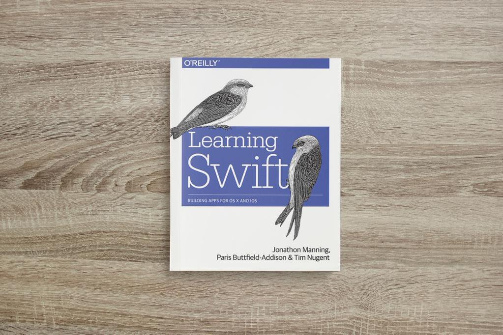

footer: Write the Docs PDX 2016
slidenumbers: true
build-lists: true
theme: Merriweather

# [fit] Code the Docs

# [fit] Interactive Documentation

---

^ Hi, we're Tim and _Paris_, and we're here to talk about code-based documentation.

---

## Tim (unicorn) and Paris (not unicorn)

^ Hi, we're Tim and _Paris_, and we're here to talk about code-based documentation.

---

### [fit] We Speak Australian

^ Please tell us if we say something you don't understand

---

^ We think a lot about documentation, as one of the main things we do is write documentation, often in the form of books.
^ all started because we wanted a closer linkage between our books and the provided code

---

### [fit] People Get Lost

^ People mess up where they are when moving between the code and the books
^ People have a disconnect between what they see and what they do

---

## Interactive document environments?

- Swift Playgrounds

- IPython Notebooks

- ... which are now Jupyter Notebooks

- ...and a few others

---

---
## Swift 

- Introduced 2 years ago by Apple
- Currently at version 2.2
- Made open source in December 2015[^1]
- Apache License 2.0
- Currently supports OS X and Linux
- Windows support on the way

[^1]: For more information on the Swift project, check out their website: http://swift.org/
^ biased, but we think its the bees knees

---

## Swift Playgrounds

- an interactive Swift coding environment
- each statement is evaluated and displayed
- designed for prototyping, experimentation, and learning
- can be paginated
- supports Markdown (yay?!)

---

## Markup in Playgrounds

^ Comment on Erik's opinions on markdown.
^ these are still new
^ we think it will get support for more later, apple already uses Sphinx

---

## IPython Notebooks

- Interactive Python coding environment
- works pretty much the same as Swift Playgrounds
- designed for academic and scientific documentation
- Supports text, equations, and graphs

^ been around for a while
^ rarely used to teach

---

---

## Project Jupyter

- Successor to IPython
- Started in 2014
- Supports multiple languages
- Otherwise the same as IPython Notebooks

---

## Demo-Gods I Summon Thee!

^ time to be gutsy
^ that's pjf, a super nice guy

---

## Swift Playgrounds

^ Let's take a more detailed look at Swift playgrounds, our favourite example of this sort of thing!
^ we think this basically because they are more or less designed for it

---

## Live Demo!

^ DEMO: Creating new documentation for something (maths)
^ put a bird on it

---

## [fit] Live Demo!

^ DEMO: Newton's Cradle
^ shows off that they are super powerful

---

^ This is a quick run-through of 

---

## [fit] Project Jupyter

---

## [fit] Live Demo!

^ our favourite example is ORMs regex golf video
^ DEMO: This is a quick run through of a live browser training course talking about regex
^ http://www.oreilly.com/oriole/
^ Its based on an XKCD comic
^ so we go through running each miniscript
^ we can run the regex to see it fails
^ meh who cares about fremont
^ lets see if it works if we add trump in!

---

^ This is a quick run through of a live browser training course talking about regex
^ http://www.oreilly.com/oriole/
^ Its based on an XKCD comic
^ so we go through running each miniscript
^ we can run the regex to see it fails
^ meh who cares about fremont
^ lets see if it works if we add trump in!

---

## Strengths

- Code and Docs __literally__ together
- ... also notes by the person reading the docs	
- Can change things on the fly
- Mixed Media

^ in theory we've had all this for a while but people have only really started using it

---

# [fit] You can mix notes, live code, and docs

^ this was sort of a suprise to us
^ but we've found people REALLY like being able to do this

---

> I find the documentation and my own notes living alongside the code to be incredibly handy. It means I don't get lost learning this language and APIs.
-- feedback Swift training in Melbourne, May 2016

^ we are pretty aggressive about asking for feedback, it mostly works

---

## Weaknesses 

- Kinda crashy...
- Limited language/framework support
- Doesn't hook into docs tools
- Only really works for narratives
- Not every language/platform/thing

^ for example playgrounds only support markdown

---

## What's next?

- Boffins will fix the tech
- Be easier to add in new languages & projects
- This will replace/become books & articles
- Better support for non-narrative documentation
- More integration with video and screensharing

---

## Where to learn more...

- On a Mac? Download Xcode from the App Store
    - Then play in Playgrounds.
- On something else? Download Jupyter Notebook
	- The process is complex
	- The docs for this are bad...

^ best way to learn is to mess around with it

---

---

## Thanks!

- Questions? Find us up the front..
- .. or find us on Twitter!
    - @the_mcjones (horse)
	- @parisba (not horse)
- Slides and notes available at:
https://github.com/parisba/presentations

